# Installing Jenkins and Setting up CICD Pipeline

### Introduction
<TBD>

### 1. Installing Jenkins

We need a server to setup Jenkins so that it can be accessed globally and by other services that we integrate with Jenkins. The bare minimum for us is to have a static-ip or a valid DNS name that points to this server. This will be used by external services like GitHub to notify us of with new events.

If you already have a server available, you can skip the next step.

#### 1.1. Setting up a DigitalOcean Droplet

DigitalOcean is a cloud provider that makes it very easy to set up virtual servers, called droplets. If you do not have a DigitalOcean account already you can use this [link](https://m.do.co/c/cb7d1ddd1002) to get $100 in credit over 60 days. It's a great way to try things out.

You can now head over the droplets management console ([link](https://cloud.digitalocean.com/droplets)) and click on "Create Droplet". Next choose the image that this droplet will be based on, for the purpose of this tutorial select Ubuntu 18.04, the latest Ubuntu LTS version at the time of writing. You want to start out low, so select the plan of $5/month. Next for datacenter, choose the one which is closest to you, for me it's Bangalore. If you have SSH keys, you can add or select the one already in your account. If you do not have keys, you can skip this step, you will later see how to use user passwords to log in. Give a hostname that can be used to identify the purpose of this droplet like 'jenkins-test'. Your final screen should look something like below. When you have verified all details click on "Create".

https://www.awesomescreenshot.com/image/3997340/bd32f1f38f5c9742cff02c3adc7c9f8f

Once the droplet is created, you have two options to log into the droplet.
1. You can use SSH keys, if you used them when creating the droplet.
2. You can use username/password, we will use this method.

On successful creation of the droplet, you would receive the IP address of the droplet, username and password via email. Open a terminal type in the following command to log into the server.

```bash
$ ssh <username>@<public ip address>
```

You may be prompted to add the IP address to the list of known hots, accept it. Enter your password when prompted for it next. You may be asked to reset password.

In this step you created a virtual server or a droplet that you can now use to install Jenkins and let other external services reach out this instance of Jenkins.

#### 1.2. Installing Jenkins

Start off by first making sure that the packages on the server are up to date. Run the following commands to update system packages.

```bash
$ sudo apt update
$ sudo apt upgrade
```

This may take a few minutes. Now you will install Java 8 runtime environment that is required to run Jenkins. To do so run the following command:

```bash
$ sudo apt install openjdk-8-jdk
$ java -version # verify installation
```

Now you are ready to install Jenkins itself. Begin by adding the repository key to the system so that it knows that the source of this package can be trusted:
```bash
$ wget -q -O - https://pkg.jenkins.io/debian/jenkins.io.key | sudo apt-key add -
```

Next add the debian package repository. This will tell the system where to find the package:
```bash
$ sudo sh -c 'echo deb http://pkg.jenkins.io/debian-stable binary/ > /etc/apt/sources.list.d/jenkins.list'
```

Now use the following command to instruct 'apt' to start using the new source
```bash
$ sudo apt-get update
```

Finally, install Jenkins
```bash
$ sudo apt-get install jenkins
```

Congratulations! You have successfully installed Jenkins. You can now visit your Jenkins setup at '<public ip address>:8080'. Note that Jenkins by default listens on port '8080'. In the next step we will set up a root user and also install various plugins to make things easy for us.

### 2. Setting up Root User

When you go to access your Jenkins setup for the first time at '<public ip address>:8080', you will be asked to provide a password to "Unlock Jenkins". This is a way to ensure that the person setting things up has access to the server as this password is stored on the server.


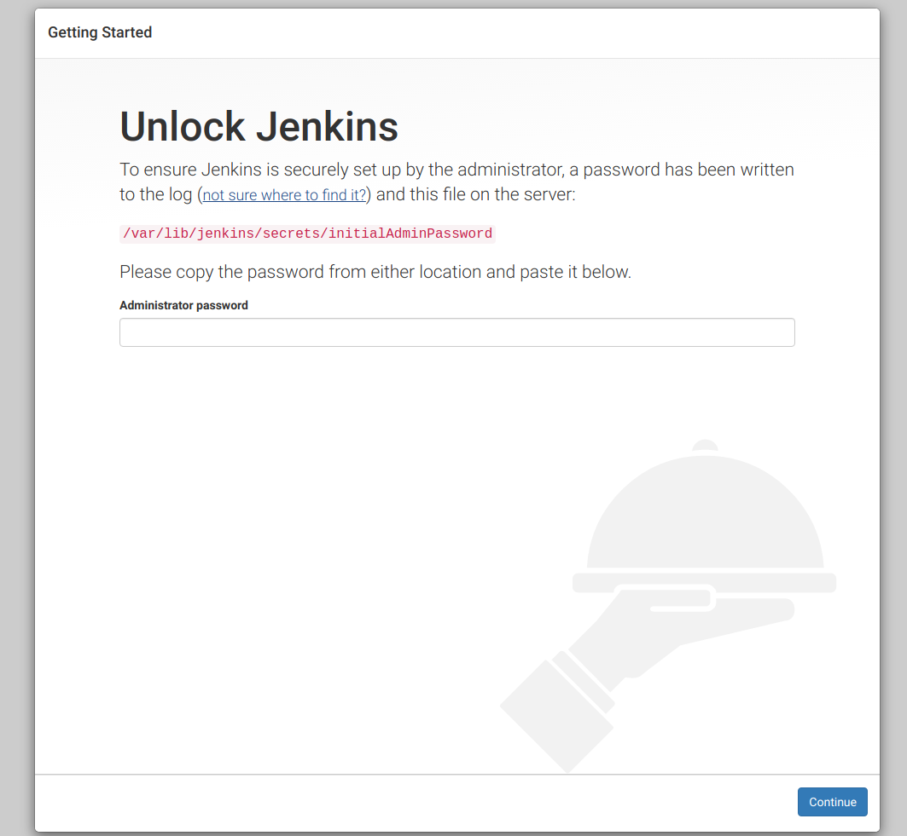

Fetch this password by running the following command:
```bash
$ cat /var/lib/jenkins/secrets/initialAdminPassword
```

On the next screen you would be prompted to select the plugin packages. Go ahead by selecting "Install suggested plugins":
Jenkins_SetupWizard_Select_Plugins_Type.png


On the next screen, you can see the progress of the installation.


After the installation is completed you will be asked to create your first admin user.

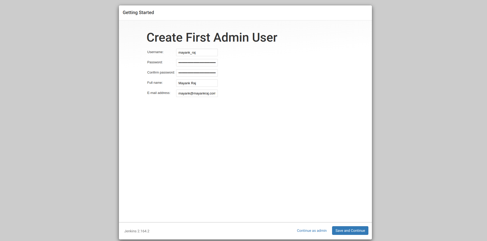

On the next screen you will be asked to provide the domain name which will be used by Jenkins. This generally is the subdomain of your company like 'jenkins.example.com' or 'automation.example.com'. For the purpose of this tutorial we will use the public IP which we are using to access this server:

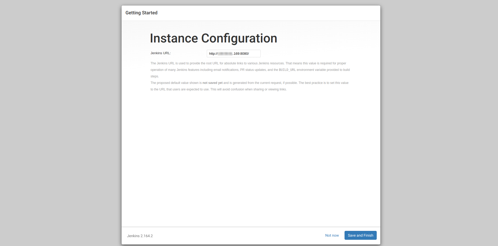

Click "Save and Finish" to complete the setup. You will now be redirected to your dashboard.

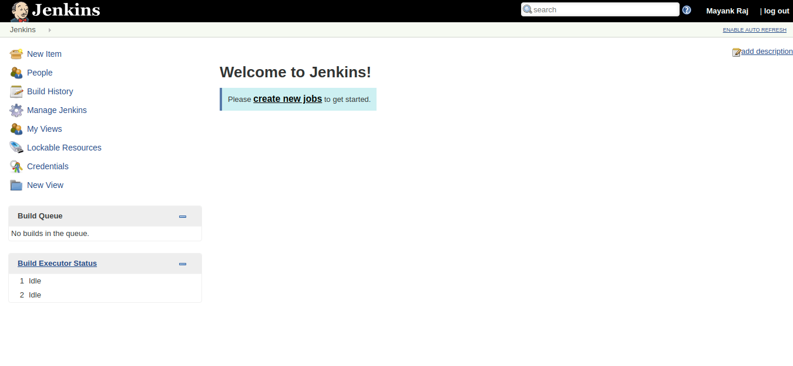

In this step you have successfully installed Jenkins. You are now ready to connect Jenkins with GitHub.

### 3. Installing Jenkins Blue

Jenkins Blue Ocean provides a new interface to interact with Jenkins. It is being developed by the very team behind Jenkins and is available as a plugin.
You can install it by first selecting the "Manage Jenkins" from the left navigation bar and then selecting "Manage Plugins"


Next click on "Available" tab and search for "Blue Ocean". Check the checkbox against it and click on "Install without restart" in the bottom. This will install the Jenkins Blue Ocean Plugin.


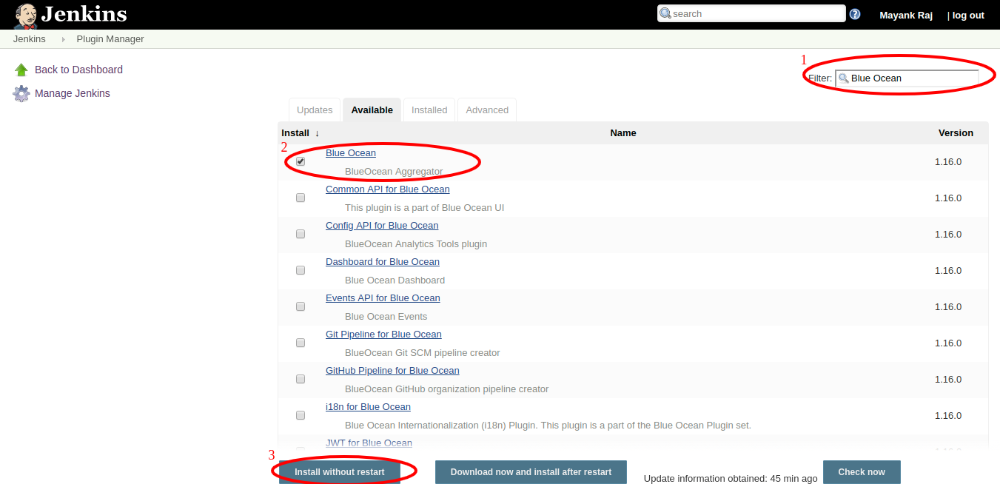

When the installation completes, you will be able to access the new interface at '<public ip address>:8080/blue'

### 4. Setting up a pipeline and Connecting to GitHub

When you open Blue Ocean for the first time, you would be asked to create a pipeline.


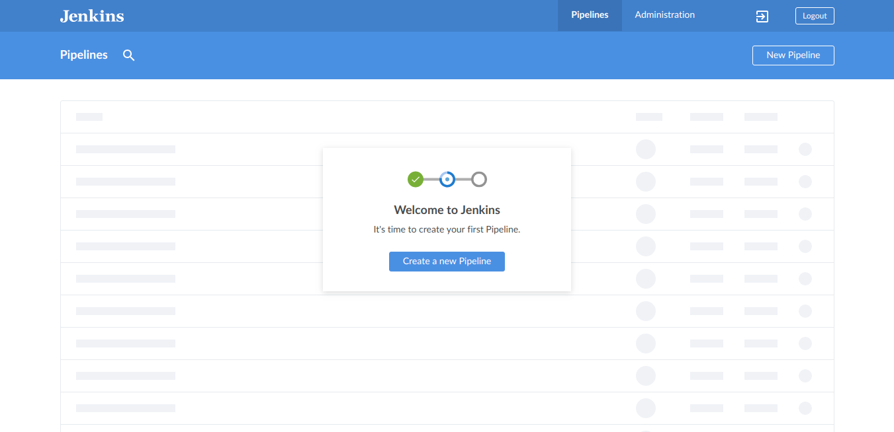

> 'Pipeline' is a set of procedures that you define having various tasks like running test cases, verifying code sanity, creating deployment packages and even deploying to the production servers. There are triggers associated with each pipeline that can be used to set the tasks in motion. Each run of the tasks in pipeline is called a 'Job'

You will be using GitHub actions as a trigger. This would trigger jobs for each commit, pull request etc. First let's create a pipeline. Start by clicking on "Create a new Pipeline". On the next screen you will be asked where the codebase resides, select GitHub here. You may be required to create a new access token for GitHub. Jenkins will use this access token to authenticate itself with GitHub. Click on "Create an access token here." if you do not already have an access token. Paste the access token and click on "Connect". Next you will be asked for who owns the repository that you will be using. You can select your own username in this list or select one of the organizations that you are a part of. Now you will be able to see all the repositories that are available under the account you just selected. Select the one on which you want to create this pipeline and click on "Create Pipeline". Your final screen should look something like this:


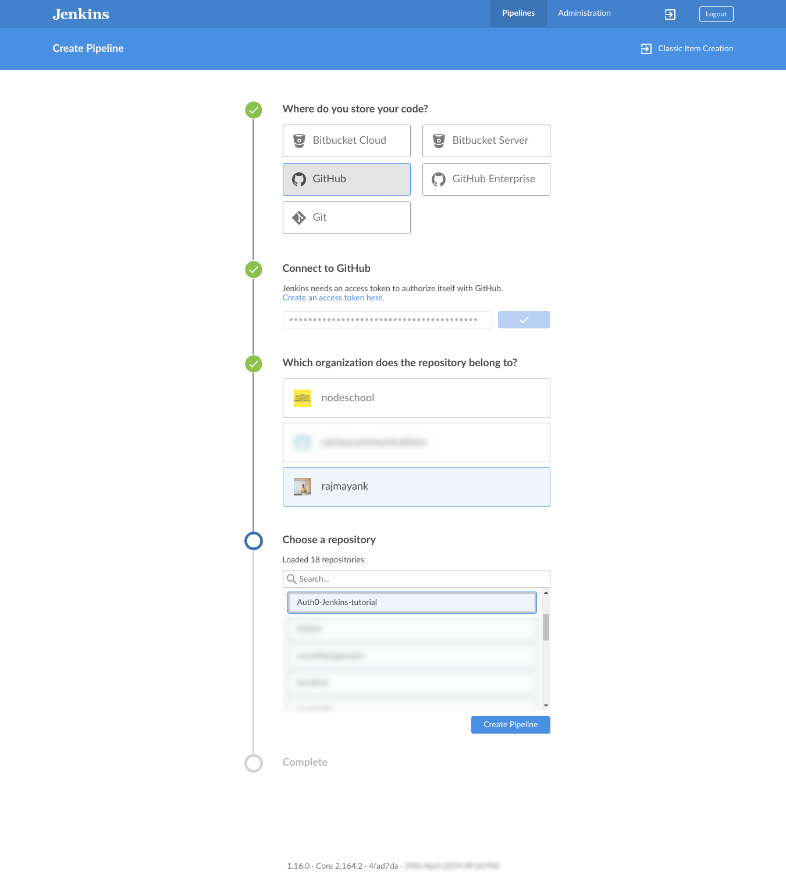

In few seconds, your pipeline will be ready. You will be redirected to the pipeline editor. This is a visual editor that can be used to create stages in pipeline which we will use in the next step.

### 5. Adding Stages to the Pipeline

> 'Stage' is a logical block of the pipeline that houses various 'steps' like build, packaging, deployment etc. 'Steps' are the individual actions performed.

For the purpose of this tutorial, we will configure our pipeline to check for presence of two files 'file-1.txt' and 'file-2.txt'. This will be our test case. In real word this would be the actual test suite of your application, eg './manage.py test' for Django app or Jasmine, Karma for Angular app etc.

To set up a stage we first need to define the 'agent' that will be used to run the stages on.
> 'Agent' is the actual host or the environment where the stages or event the whole pipeline will be executed.
Jenkins is build for distributed architecture. So you may have one master node and various slave nodes that would actually run the jobs. Or even a simple scenario is that you want to run test cases inside a docker container that has all the dependencies pre-installed in it.
In our case, we will not use any external agents and instead run the pipeline on the host server itself. For this select "any" in the dropdown under "Agent" on the right-hand side. You may also add any environment variables if your application required it. Leave it blank for now.


To add a stage, click on the Plus button next to "Start" in the pipeline editor. This will create a new Stage. On the right-hand side, you can name the stage and also define its function. To add a step click on "Add Step". In this step we will check for the presence of the file "file-1.txt". Name this step as "Check for file-1.txt"
Here you will see various options like "Shell Script", "Sleep", "Mail" etc. For now select "Shell Script" and use the command 'cat test-1.txt' to check if the file exists. Your pipeline should now look like in the following image:

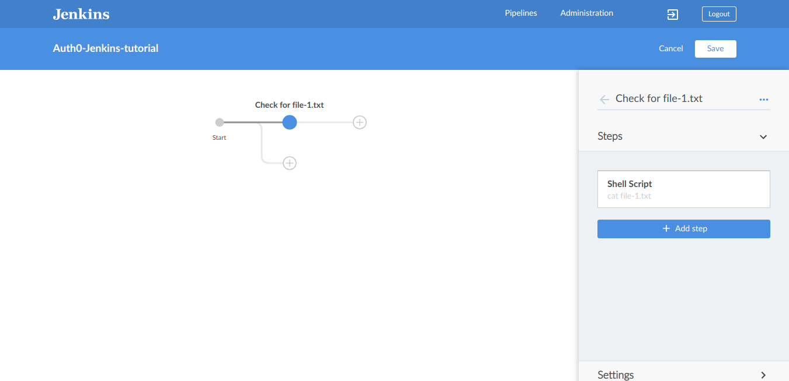

Similarly add a stage which checks for 'file-2.txt'. You should now have a pipeline as below:

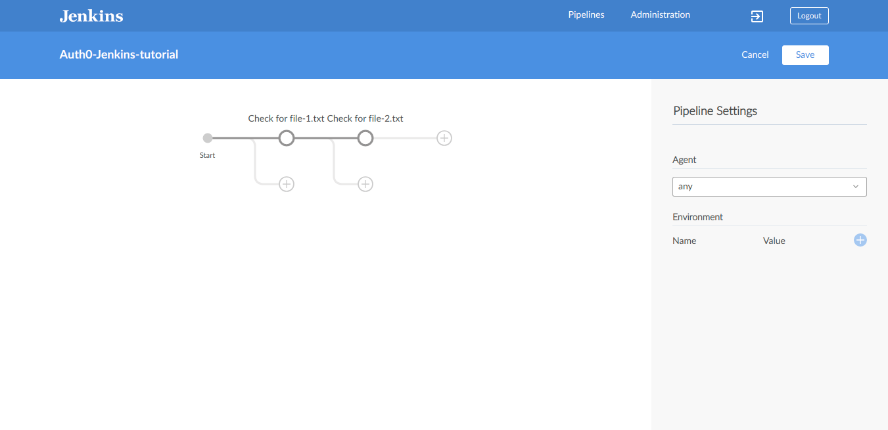

Now we need to save this pipeline to our repository. Pipelines are nothing but configuration stored in the 'Jenkinsfile' in the root of your repository. You can directly write rules in this file without using the visual editor as well. To learn more follow this [link](https://jenkins.io/doc/book/pipeline/jenkinsfile/). As we are using the visual editor at the moment, we will save this file from the editor itself. Click on "Save" on top right. This step simply creates a new commit into the branch of your choice. Add a commit message and select the master branch.


Finally, click on "Save and Run". This will create a new commit to your branch and include the new Jenkins file in it. It will also trigger the build.

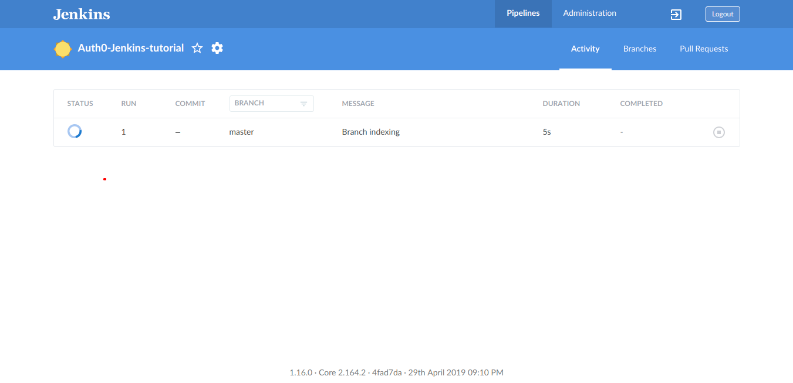

In this step, you defined the stages of your pipeline and also triggered your first build.

### 6. Setting up GitHub Webhook.

You can now manually trigger build by going into the "Branches" tab and clicking the play icon next to the branch of your choice. But this is not very efficient, you want such builds to be triggered automatically whenever a new commit is made in any branch. GitHub provides a feature of webhooks, which can be used to notify Jenkins whenever new commit is made, which can then be used by Jenkins to trigger build automatically.
Head to GitHub repository configured with the pipeline and click on the "Settings" tab on the top. In the Navigation bar on left select "Webhooks". Next click on "Add Webhook". You will be asked for payload URL, enter a URL of the format 'http://<public ip address>/github-webhook/'. Leave everything else as default and click on "Add Webhook". Your screen should look like below:


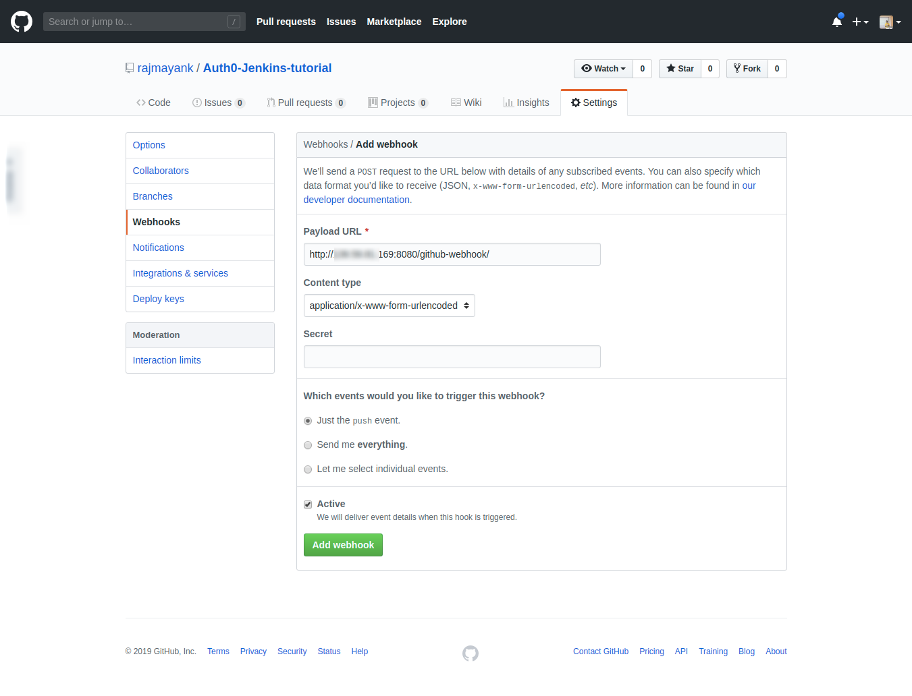

With this you have told GitHub to notify Jenkins whenever any commit is made.

### 7. Triggering first Automated Build

Now make the first commit to the repository and make sure to add the two files 'file-1.txt' and 'file-2.txt' so that our build stages can find them and our build would pass. Few things you can observe when a build is running:
1. On pushing the commit to GitHub, the build is automatically triggered, you can see it on the Pipeline Homepage on Jenkins
2. When the build is ongoing, on the GitHub's web interface you will see a yellow dot indicating the build is in progress. This will change to a green dot if the build passes or a red cross if the build fails.

Start by pushing your commit to GitHub by using
```bash
$ git push origin master
```

You can see the build status on GitHub as below:

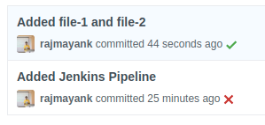

You can also see the build status on Jenkins as below:

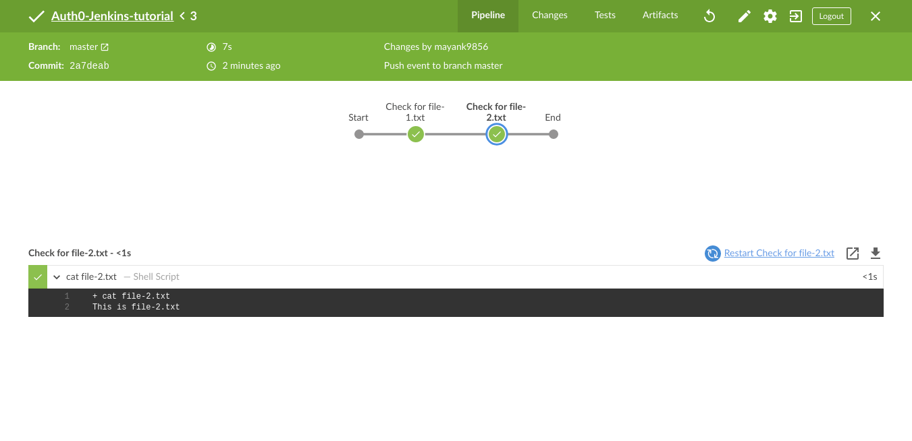

In this step, you triggered the job by pushing the commit to GitHub. Any new commit to this repository will now trigger builds and the the end result would be automatically updated on GitHub.

### 8. Recording Test Results and Artifacts

Whenever a new build is initiated, it is started with a shallow clone of the branch on which the build is triggered i.e. a new folder is created and the branch on which the action was made is cloned in it. This is done to ensure that each build is isolated from the other. This also means that for 10 build you will have 10 folders somewhere in the server where Jenkins is hosted with clone of your repository. This is not a ideal situation, you do not want to keep a copy of each and every run. For ths reason, at the end of each build, a cleanup process automatically deletes the folder. Now this raises a another question - "I don't want to keep the whole codebase of each build but only the result of the test cases, will deleting the folder not delete that as well?". The answer is - No. Jenkins has the concept of "Artifacts". Any file/folder that you may want to keep even after the build is completed, you can add it to the build artifacts, which are preserved for each build. If you are curious, you can see the location where these folders are created is `/var/lib/jenkins/workspace/`.

You will now add real world test cases to your project and also make sure that the results of these test cases are captured in Jenkins. Jenkins understands JUnit XML format of test results which is considered to be a standard. Every test runner today has some or the other way to give report in JUnit XML. This tutorial will use [MochaJS](https://mochajs.org/) as a testing framework.

Start by inititalizing a npm module by runnign the following command:

```bash
$ npm init -y
```

Next add the two dependancies that the app needs:

```bash
$ npm install --save-dev mocha 					# our test case runner
$ npm install --save-dev mocha-jenkins-reporter 	# repor results in JUnit XML
```

Next create a file `test.js` and write a few sample test cases. You can use the below code:

```javascript
var assert = require('assert');

describe('Addition', function() {
    it('2 + 2 should be 4', function() {
        assert.equal((2 + 2), 4);
    });

    it('1 + 5 should be 6', function() {
        assert.equal((1 + 5), 6);
    });
});

describe('Type Comparison', function() {
    it('\'5\' == 5 should be true', function() {
        assert.equal(('5' == 5), true);
    });
    it('\'5\' === 5 should be false', function() {
        assert.equal(('5' === 5), false);
    });
});
````

Use the following command to now run these test cases:

```bash
$ node_modules/mocha/bin/mocha
```

You will notice that all the test cases passes. Try altering values to see the results when they fail. Now to generate report in JUnit XML format use the following command:

```bash
$ JUNIT_REPORT_PATH=./test-results.xml ./node_modules/mocha/bin/mocha --reporter mocha-jenkins-reporter
```

This will save the results to a file at `./test-results.xml`. You will now instruct Jenkins Pipeline to use this file to. First push this new updated code with:

```bash
$ git add . && git commit -m "Added Test Cases" && git push origin master
```

Now that the application has few test cases, the next step is to tell Jenkins how to run these test cases and where to find the XML Report fo the same. Head over to the pipeline editor and add the following steps:
1. Install Dependancies
2. Run Test Cases
3. Archive JUnit-formatted test results

Begin by adding a new step in the pipeline to install dependancies. This is done with the command `npm install -dev`. To run this command add a new stage that runs this command. Your pipeline with this new stage should look like this:


Next step is to run the command that will run the test cases. Like the last step add a step that executes the command you had used earlier to run test cases and build JUnit XML.


Click on "Save" to save this updated pipeline. Note that any global dependencies that you application needs to run any stages, need to be installed on the server. In this case these are node and npm.

Finally we need to add the step to capture this JUnit formatted results file. You can go ahead and create a step for it but the correct way is to add it in the `Post` stage of the pipeline. The pipeline visual editor, for now doesn't allow you to edit the post section. For this, you will be updating the `Jenkinsfile` directly. Open this file at the root of your repository and add the following at the level of `stages`:

```XML
  post {
    always {
      junit 'test-results.xml'
    }
  }
```

Your final `Jenkisfile` should now look like:

```XML
pipeline {
  agent any
  stages {
    stage('Check for file-1.txt') {
      steps {
        sh 'cat file-1.txt'
      }
    }
    stage('Check for file-2.txt') {
      steps {
        sh 'cat file-2.txt'
      }
    }
    stage('npm install') {
      steps {
        sh 'npm install'
      }
    }
    stage('Run Tests') {
      steps {
        sh 'JUNIT_REPORT_PATH=./test-results.xml ./node_modules/mocha/bin/mocha --reporter mocha-jenkins-reporter'
      }
    }
  }
  post {
    always {
      junit 'test-results.xml'
    }
  }
}
``` 

Add and commit this file to your repository. When

Now when you go to see your build on Jenkins, you will see that the "Tests" tab on the top is pipulated with results of your test cases. When all the test cases pass, you can see the message "All tests are passing" like so:


Now whenever any test case fails, you will be able to see it in this tab. Notice how the green color is now changed to red.

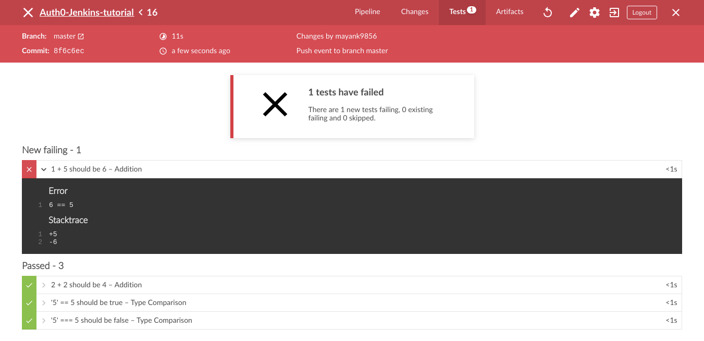


In this step you learnt hor to record the results of test cases. You also saw how the status of individual tets cases are tracked over builds.

### 9. Exploring plugins

Just like any other opensourced projects, plugins are what gives Jenkins the power to do a lot more. You can find various plugins [here](https://plugins.jenkins.io/). You can find plugins that can notify the build status to your slack channel ([Slack Notification](https://plugins.jenkins.io/slack)). If you want to take your Jenkins setup towards the Kubernetes route you have the [Kubernetes Plugin](https://plugins.jenkins.io/kubernetes), or if you prefer to use cloud container services there are options like [Amazon Elastic Container Service](https://plugins.jenkins.io/amazon-ecs) and [Azure Container Service](https://plugins.jenkins.io/azure-acs).


### Conclusion
<TBD>
