# Installing Jenkins and Setting up CICD Pipeline

### Introduction
<TBD>

### 1. Installing Jenkins

We need a server to setup Jenkins so that it can be accessed globally and by other services that we integrate with Jenkins. The bare minimum for us is to have a static-ip or a valid DNS name that points to this server. This will be used by external services like GitHub to notify us of with new events.

If you already have a server available, you can skip the next step.

#### 1.1. Setting up a DigitalOcean Droplet

DigitalOcean is a cloud provider that makes it very easy to set up virtual servers, called droplets. If you do not have a DigitalOcean account already you can use this [link](https://m.do.co/c/cb7d1ddd1002) to get $100 in credit over 60 days. It's a great way to try things out.

You can now head over the droplets management console ([link](https://cloud.digitalocean.com/droplets)) and click on "Create Droplet". Next choose the image that this droplet will be based on, for the purpose of this tutorial select Ubuntu 18.04, the latest Ubuntu LTS version at the time of writing. You want to start out low, so select the plan of $5/month. Next for datacenter, choose the one which is closest to you, for me it's Bangalore. If you have SSH keys, you can add or select the one already in your account. If you do not have keys, you can skip this step, you will later see how to use user passwords to log in. Give a hostname that can be used to identify the purpose of this droplet like 'jenkins-test'. Your final screen should look something like below. When you have verified all details click on "Create".

https://www.awesomescreenshot.com/image/3997340/bd32f1f38f5c9742cff02c3adc7c9f8f

Once the droplet is created, you have two options to log into the droplet.
1. You can use SSH keys, if you used them when creating the droplet.
2. You can use username/password, we will use this method.

On successful creation of the droplet, you would receive the IP address of the droplet, username and password via email. Open a terminal type in the following command to log into the server.

'''bash
$ ssh <username>@<public ip address>
'''

You may be prompted to add the IP address to the list of known hots, accept it. Enter your password when prompted for it next. You may be asked to reset password.

In this step you created a virtual server or a droplet that you can now use to install Jenkins and let other external services reach out this instance of Jenkins.

#### 1.2. Installing Jenkins

Start off by first making sure that the packages on the server is up to date. Run the following commands to update system packages.

'''bash
$ sudo apt update
$ sudo apt upgrade
'''

This may take a few minutes. Now you will install Java 8 runtime environment that is required to run Jenkins. To do so run the following command:

'''bash
$ sudo apt install openjdk-8-jdk
$ java -version # verify installation
'''

Now you are ready to install Jenkins itself. Begin by adding the repository key to the system so that it knows that the source of this package can be trusted:
'''bash
$ wget -q -O - https://pkg.jenkins.io/debian/jenkins.io.key | sudo apt-key add -
'''

Next add the debian package repository. This will tell the system where to find the package:
'''bash
$ sudo sh -c 'echo deb http://pkg.jenkins.io/debian-stable binary/ > /etc/apt/sources.list.d/jenkins.list'
'''

Now use the following command to instruct 'apt' to start using the new source
'''bash
$ sudo apt-get update
'''

Finally, install Jenkins
'''bash
$ sudo apt-get install jenkins
'''

Congratulations! You have successfully installed Jenkins. You can now visit your Jenkins setup at '<public ip address>:8080'. Note that Jenkins by default listens on port '8080'. In the next step we will set up a root user and also install various plugins to make things easy for us.

### 2. Setting up Root User

When you go to access your Jenkins setup for the first time at '<public ip address>:8080', you will be asked to provide a password to "Unlock Jenkins". This is a way to ensure that the person setting things up has access to the server as this password is stored on the server.

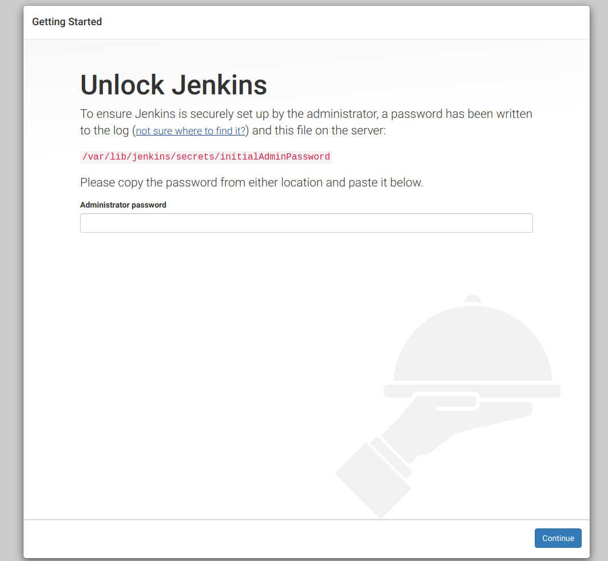

Fetch this password by running the following command:
'''bash
$ cat /var/lib/jenkins/secrets/initialAdminPassword
'''

On the next screen you would be prompted to select the plugin packages. Go ahead by selecting "Install suggested plugins":
Jenkins_SetupWizard_Select_Plugins_Type.png

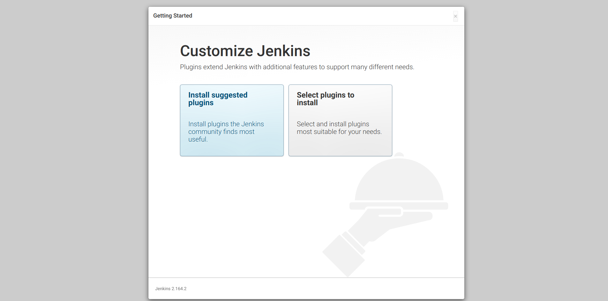

On the next screen, you can see the progress of the installation.
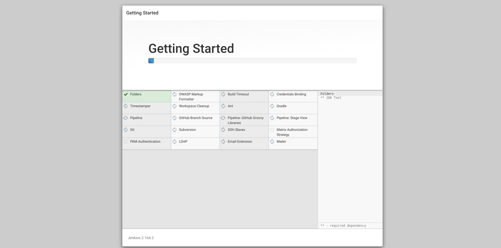

After the installation is completed you will be asked to create your first admin user.
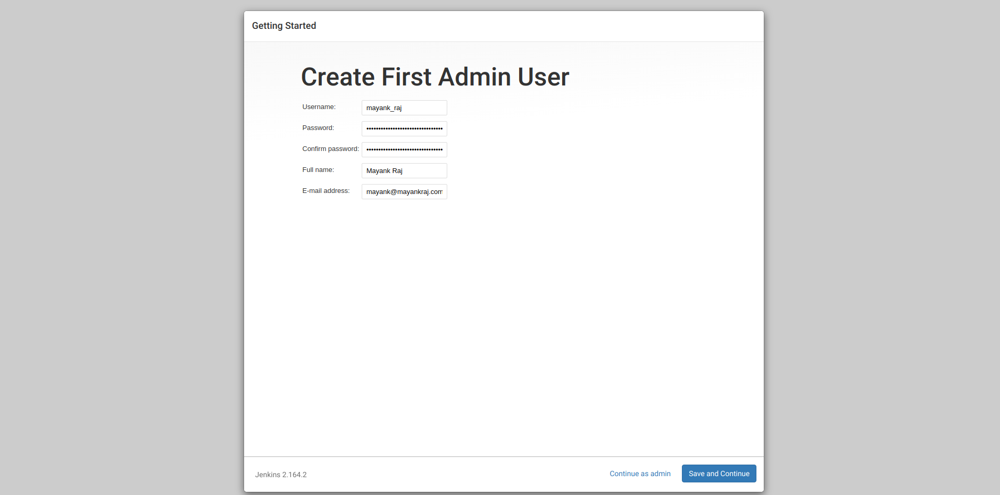

On the next screen you will be asked to provide the domain name which will be used by Jenkins. This generally is the subdomain of your company like 'jenkins.example.com' or 'automation.example.com'. For the purpose of this tutorial we will use the public IP which we are using to access this server:
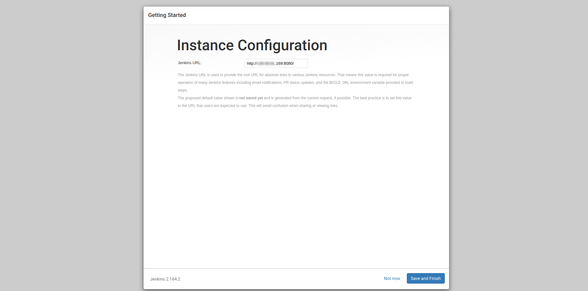

Click "Save and Finish" to complete the setup. You will now be redirected to your dashboard.
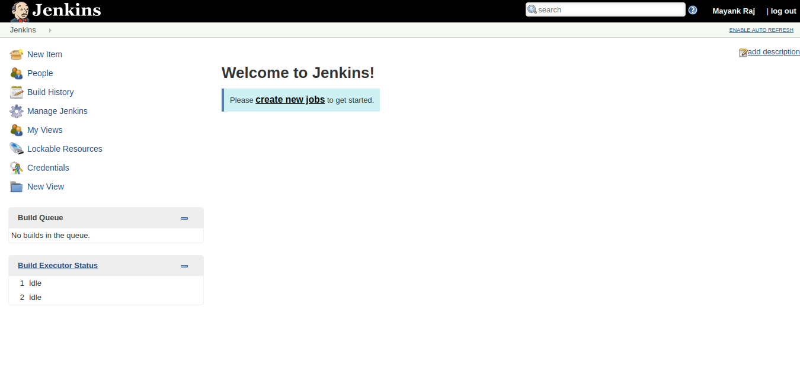

In this step you have successfully installed Jenkins. You are now ready to connect Jenkins with GitHub.

### 3. Installing Jenkins Blue

Jenkins Blue Ocean provides a new interface to interact with Jenkins. It is being developed by the very team behind Jenkins and is available as a plugin.
You can install it by first selecting the "Manage Jenkins" from the left navigation bar and then selecting "Manage Plugins"

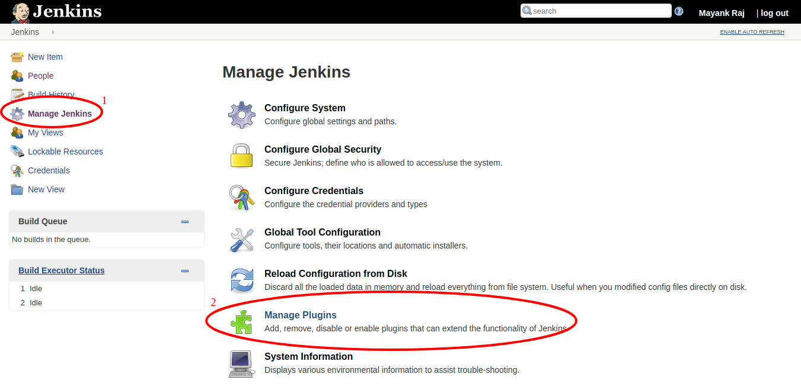

Next click on "Available" tab and search for "Blue Ocean". Check the checkbox against it and click on "Install without restart" in the bottom. This will install the Jenkins Blue Ocean Plugin.

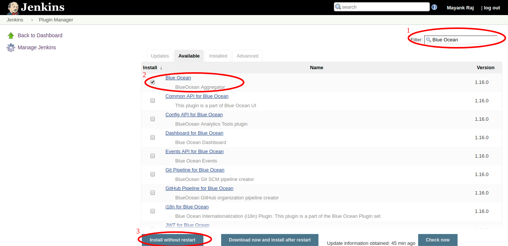

When the installation completes, you will be able to access the new interface at '<public ip address>:8080/blue'

### 4. Setting up a pipeline and Connecting to GitHub

When you open Blue Ocean for the first time, you would be asked to create a pipeline.

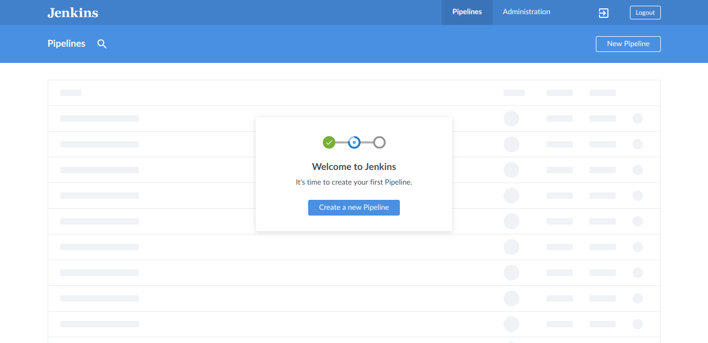

> 'Pipeline' is a set of procedures that you define having various tasks like running test cases, verifying code sanity, creating deployment packages and even deploying to the production servers. There are triggers associated with each pipeline that can be used to set the tasks in motion. Each run of the tasks in pipeline is called a 'Job'

You will be using GitHub actions as a trigger. This would trigger jobs for each commit, pull request etc. First let's create a pipeline. Start by clicking on "Create a new Pipeline". On the next screen you will be asked where the codebase resides, select GitHub here. You may be required to create a new access token for GitHub. Jenkins will use this access token to authenticate itself with GitHub. Click on "Create an access token here." if you do not already have a access token. Paste the access token and click on "Connect". Next you will be asked for who owns the repository that you will be using. You can select your own username in this list or select one of the organizations that you are a part of. Now you will be able to see all the repositories that are available under the account you just selected. Select the one on which you want to create this pipeline and click on "Create Pipeline". Your final screen should look something like this:

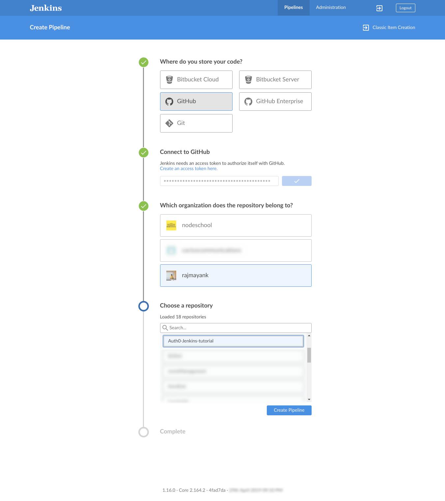

In few seconds, your pipeline will be ready. You will be redirected to the pipeline editor. This is a visual editor that can be used to create stages in pipeline which we will use in the next step.

### 5. Adding Stages to the Pipeline

> 'Stage' is a logical block of the pipeline that houses various 'steps' like build, packaging, deployment etc. 'Steps' are the individual actions performed.

For the purpose of this tutorial, we will configure our pipeline to check for presence of two files 'file-1.txt' and 'file-2.txt'. This will be our test case. In real word this would be the actual test suite of your application, eg './manage.py test' for Django app or Jasmine, Karma for Angular app etc.

To set up a stage we first need to define the 'agent' that will be used to run the stages on.
> 'Agent' is the actual host or the environment where the stages or event the whole pipeline will be executed.
Jenkins is build for distributed architecture. So you may have one master node and various slave nodes that would actually run the jobs. Or even a simple scenario is that you want to run test cases inside a docker container that has all the dependencies preinstalled in it.
In our case, we will not use any external agents and instead run the pipeline on the host server itself. For this select "any" in the dropdown under "Agent" on the right-hand side. You may also add any environment variables if your application required it. Leave it blank for now.

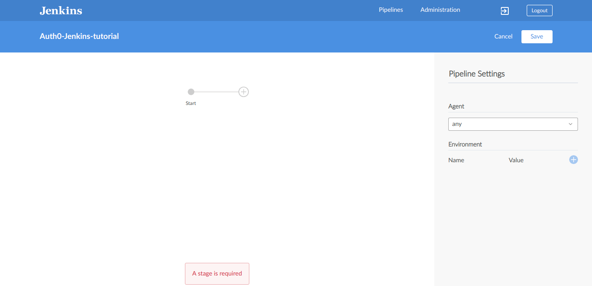

To add a stage, click on the Plus button next to "Start" in the pipeline editor. This will create a new Stage. On the right-hand side, you can name the stage and also define its function. To add a step click on "Add Step". In this step we will check for the presence of the file "file-1.txt". Name this step as "Check for file-1.txt"
Here you will see various options like "Shell Script", "Sleep", "Mail" etc. For now select "Shell Script" and use the command 'cat test-1.txt' to check if the file exists. Your pipeline should now look like in the following image:
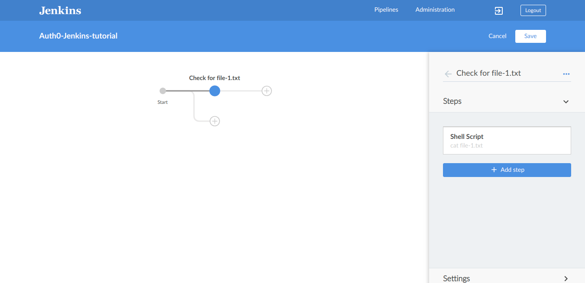

Similarly add a stage which checks for 'file-2.txt'. You should now have a pipeline as below:
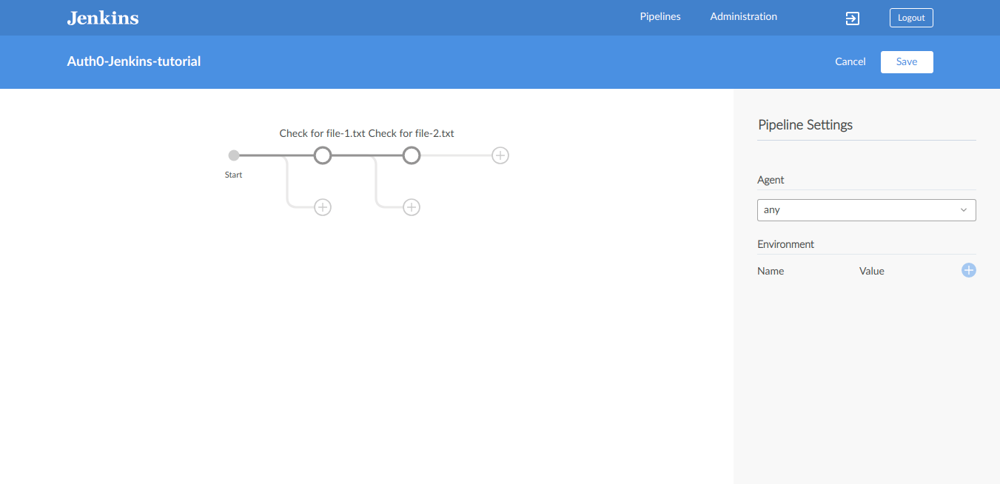

Now we need to save this pipeline to our repository. Pipeline are nothing but configuration stored in the 'Jenkinsfile' in the root of your repository. You can directly write rules in this file without using the visual editor as well. To learn more follow this [link](https://jenkins.io/doc/book/pipeline/jenkinsfile/). As we are using the visual editor at the moment, we will save this file from the editor itself. Click on "Save" on top right. This step simply creates a new commit into the branch of your choice. Add a commit message and select the master branch.
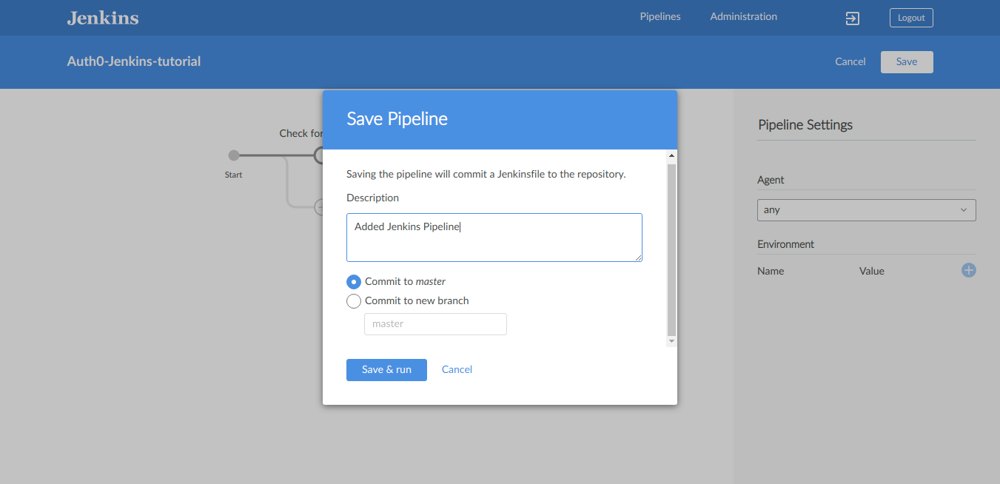

Finally, click on "Save and Run". This will create a new commit to your branch and include the new Jenkins file in it. It will also trigger the build.
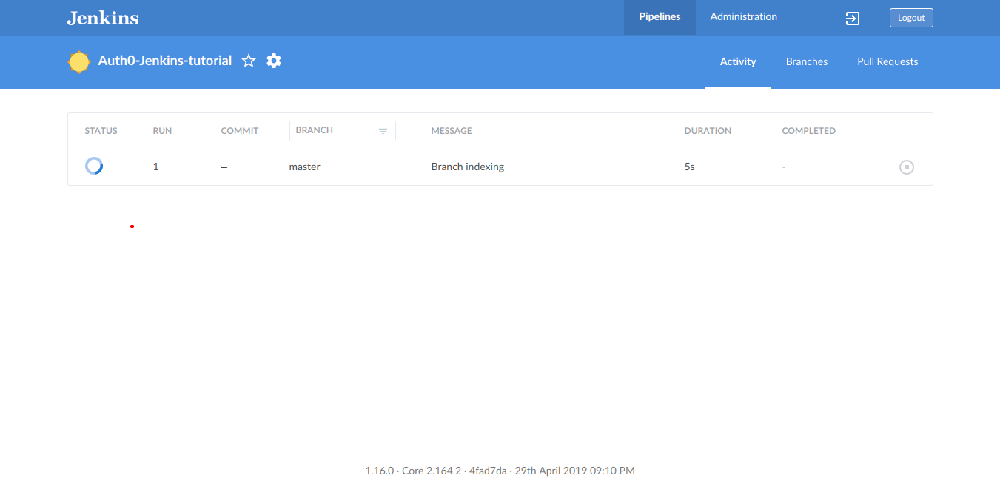

In this step, you defined the stages of your pipeline and also triggered your first build.

### 6. Setting up GitHub Webhook.

You can now manually trigger build by going into the "Branches" tab and clicking the play icon next to the branch of your choice. But this is not very efficient, you want such builds to be triggered automatically whenever a new commit is made in any branch. GitHub provides a feature of webhooks, which can be used to notify Jenkins whenever new commit is made, which can then be used by Jenkins to trigger build automatically.
Head to GitHub repository configured with the pipeline and click on the "Settings" tab on the top. In the Navigation bar on left select "Webhooks". Next click on "Add Webhook". You will be asked for payload URL, enter a URL of the format 'http://<public ip address>/github-webhook/'. Leave everything else as default and click on "Add Webhook". Your screen should look like below:
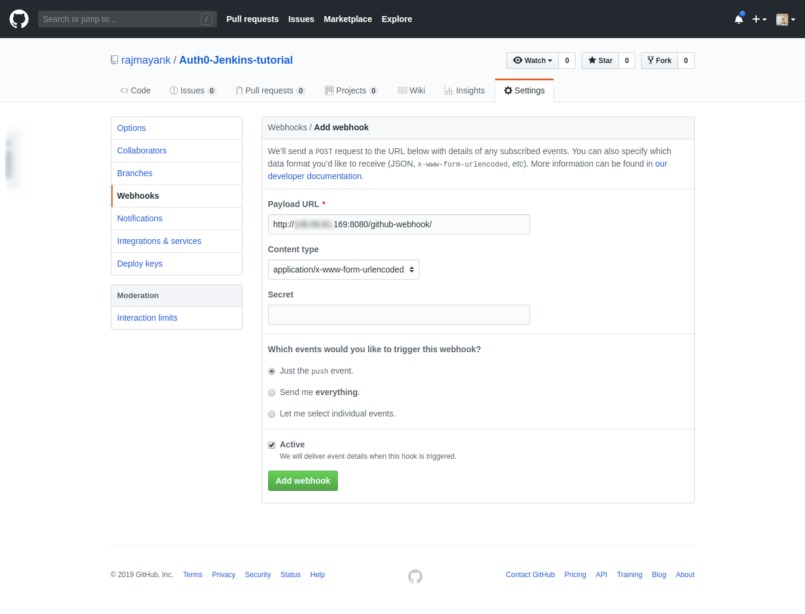

With this you have told GitHub to notify Jenkins whenever any commit is made.

### 7. Triggering first Automated Build

Now make the first commit to the repository and make sure to add the two files 'file-1.txt' and 'file-2.txt' so that our build stages can find them and our build would pass. Few things you can observe when a build is running:
1. On pushing the commit to GitHub, the build is automatically triggered, you can see it on the Pipeline Homepage on Jenkins
2. When the build is ongoing, on the GitHub's web interface you will see a yellow dot indicating the build is in progress. This will change to a green dot if the build passes or a red cross if the build fails.

Start by pushing your commit to GitHub by using
'''bash
$ git push origin master
'''

You can see the build status on GitHub as below:
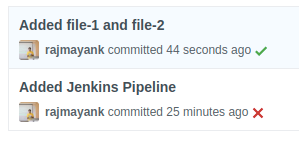

You can also see the build status on Jenkins as below:
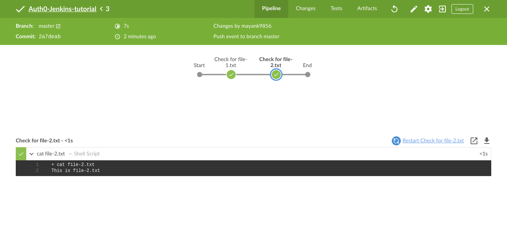

In this step, you triggered the job by pushing the commit to GitHub.

### Conclusion
<TBD>